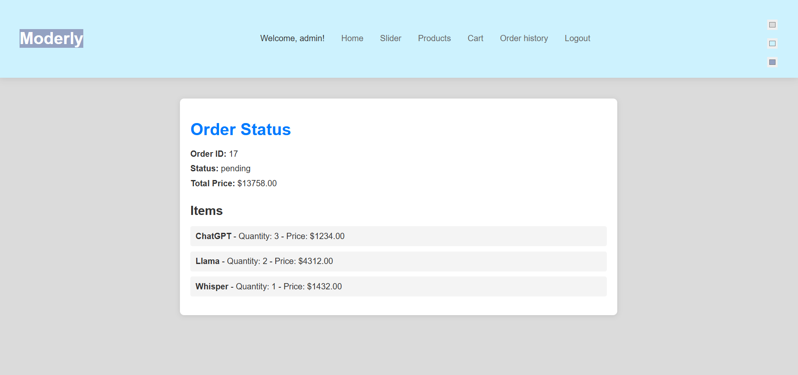

# Moderly

A platform with ready to use, predefined AI models for easy integration and fast deployment empowering businesses and startups.

## Table of Contents:
* [Getting Started](#getting-started)
  * [Prerequisites](#prerequisites)
  * [Installation](#installation-and-usage)
* [Main Features](#main-features)
* [Screenshots](#screenshots)
* [License](#license)

## Getting Started

### Prerequisites

- Python 3.9 or higher
- Pip
- Virtualenv

```bash
pip install virtualenv
```

### Installation and Usage

#### 1. Clone the repository
```bash
git clone https://github.com/Szymqn/Moderly.git
```

#### 2. Create a virtual environment
```bash
python -m venv venv
```

#### 3. Activate the virtual environment
```bash
.\.venv\Scripts\activate
```

#### 4. Install the dependencies
```bash
pip install -r .\requirements.txt
```

#### 5. Run the application
```bash
python .\manage.py runserver
```

#### 6. Open the browser and go to the following address
```console
http://127.0.0.1:8000/
```

## Main Features
- [x] Custom Login and Registration
- [x] GitHub Integration
- [x] Customers comments
- [x] Order history
- [X] RGB color picker

## Screenshots

### Home page


### Login page


### Registration page


### Slider


### Products page


### Cart


### Order history


### Order details


## License
MIT License available in file [LICENSE](LICENSE)
